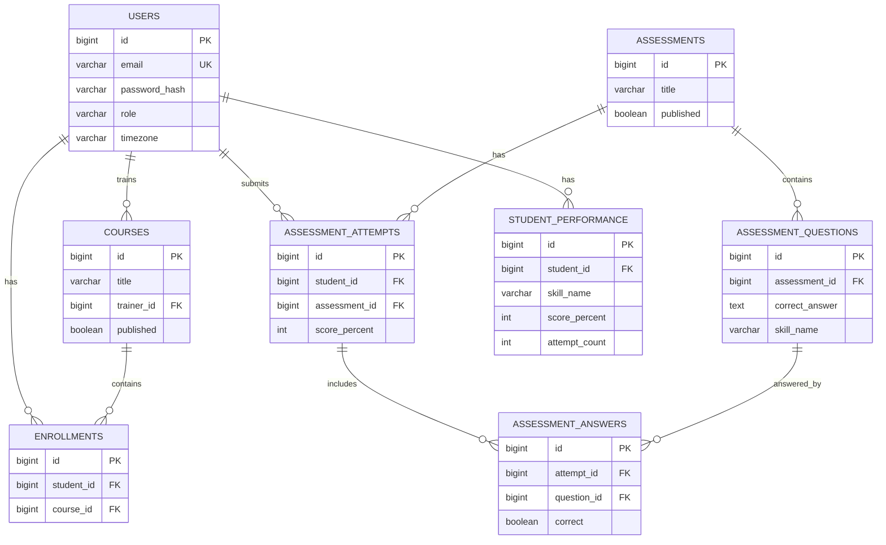

# SkillBridge AI Entity Relationship Diagram

```mermaid
erDiagram
    USERS ||--o{ COURSES : trains
    USERS ||--o{ ENROLLMENTS : has
    COURSES ||--o{ ENROLLMENTS : contains
    USERS ||--o{ ASSESSMENT_ATTEMPTS : submits
    ASSESSMENTS ||--o{ ASSESSMENT_ATTEMPTS : has
    ASSESSMENTS ||--o{ ASSESSMENT_QUESTIONS : contains
    ASSESSMENT_ATTEMPTS ||--o{ ASSESSMENT_ANSWERS : includes
    ASSESSMENT_QUESTIONS ||--o{ ASSESSMENT_ANSWERS : answered_by
    USERS ||--o{ STUDENT_PERFORMANCE : has

    USERS {
      bigint id PK
      varchar email UK
      varchar password_hash
      varchar role
      varchar timezone
    }
    COURSES {
      bigint id PK
      varchar title
      bigint trainer_id FK
      boolean published
    }
    ENROLLMENTS {
      bigint id PK
      bigint student_id FK
      bigint course_id FK
    }
    ASSESSMENTS {
      bigint id PK
      varchar title
      boolean published
    }
    ASSESSMENT_QUESTIONS {
      bigint id PK
      bigint assessment_id FK
      text correct_answer
      varchar skill_name
    }
    ASSESSMENT_ATTEMPTS {
      bigint id PK
      bigint student_id FK
      bigint assessment_id FK
      int score_percent
    }
    ASSESSMENT_ANSWERS {
      bigint id PK
      bigint attempt_id FK
      bigint question_id FK
      boolean correct
    }
    STUDENT_PERFORMANCE {
      bigint id PK
      bigint student_id FK
      varchar skill_name
      int score_percent
      int attempt_count
    }
```
